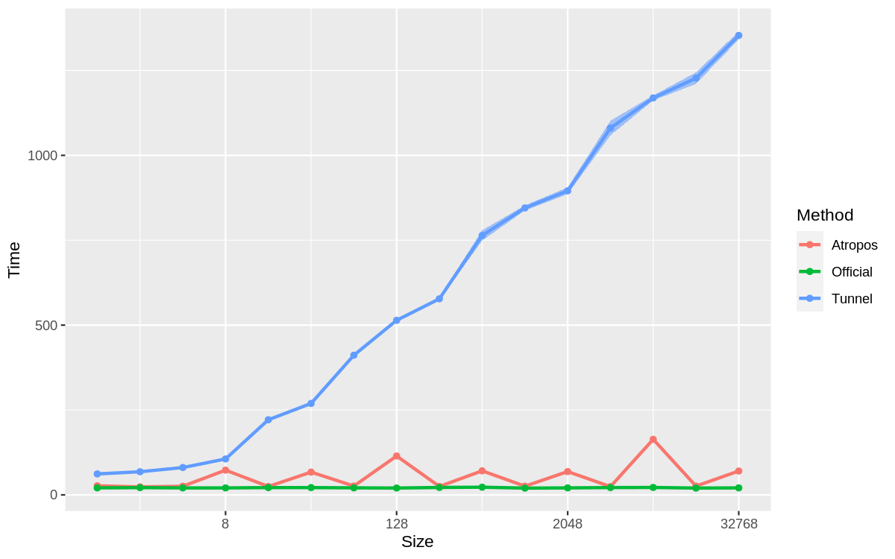
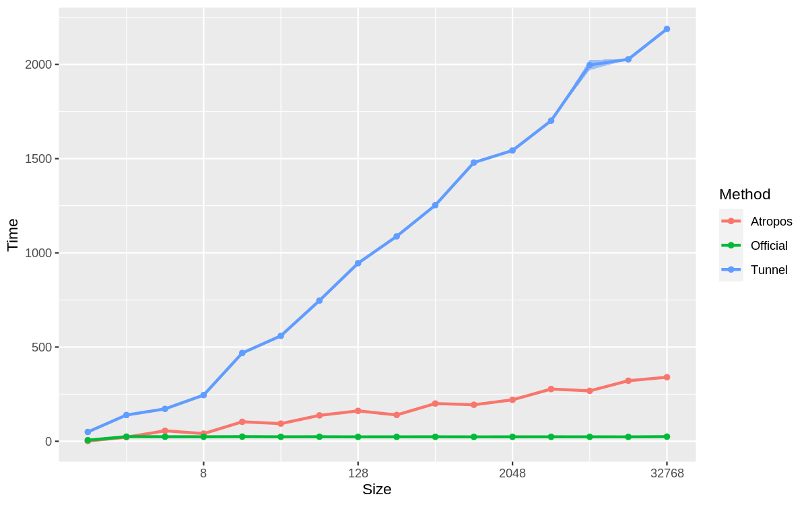

# Benchmarks
The goal of the Atropos project is to provide a reasonable performance.
In order to verify that the implementation is not utterly bad, we're comparing Atropos with the reference sources, mostly with the 
default implementation provided by the [System.Collections.Immutable] (https://docs.microsoft.com/dotnet/api/system.collections.immutable) library.
Some existing work by TunnelVisionLabs published at https://github.com/tunnelvisionlabs/dotnet-trees/ is based on the very same idea.
## [ImmutableList](../Atropos/Documentation/ImmutableList-T-.md 'Atropos.ImmutableList&lt;T&gt;')
The immutable list is partially inspired by the [Use B+-trees instead of AVL trees for Immutable Collections](https://github.com/dotnet/runtime/issues/14477) proposal for the dotnet/runtime project.
We use the B+ tree with index page size and data page size = 16. When using the sequential population, this leads to the branch factor of approximately 8, providing a good base for the 
logarithm in the operations complexity asymptotics. 
The benchmarks below were taken with the different list sizes - see the [List/ImmutableListBenchmarkBase.cs](./List/ImmutableListBenchmarkBase.cs#L39).
In most cases we used 1000 repetitions per invocation (to avoid jitter and noise related to the single operation), so the Y axis displays the single-op execution time measured in nanoseconds. 
### Index ([this[i]](../Atropos/Documentation/ImmutableList-T--this-int-.md) operation)
This is the most common operation for the lists. 
The results of running the benchmarks for the this[i] operation over the ImmutableList&lt;int&gt; are provided on the chart below. The Y axis is the single request time in nanoseconds; X axis is the collection size (with log2 scale).
Each test iteration involves 1000 requests at different indices to avoid measuring "lucky" points (AVL trees do store data at various levels, so traversal might take from 1 to log2(N) parent->child retrievals).
Note that each measure consists of this[i], integer addition, and increment - to make sure neither compiler no JIT does eliminate the access to the list elements. 
See the [List/Index.cs](./List/Index.cs) for more detail.
Anyway, the benchmark provides good enough insight on the comparative performance of the implementations for the various collection sizes.

Note how Official implementation does feature a gradual degradation somewhere between 256 and 1024 - most likely attributed to the cache effects.
Also note the stair-like behavior of the Atropos and TunnelVision implementation, reflecting their branch factors. 
### Add 
The [List/Add.cs](./List/Add.cs) benchmark measures the efficiency of a single-item insertions. 

### AddRange
There is a more efficient way to add a bunch of items to an immutable list - the idea is to keep the intermediate results mutable until it is time to return the list to the user.
This saves some (but not all) copying.
The [List/AddRange.cs](./List/AddRange.cs) benchmark adds 10 items to the list of a given size.

## [ImmutableDeque](../Atropos/Documentation/ImmutableDeque-T-.md 'Atropos.ImmutableDeque&lt;T&gt;')
The immutable deque is does extend the functionality of the System.Collections.ImmutableQueue by allowing enqueuing and dequeuing from both ends. 
Since the operations are perfectly symmetric, the benchmarks compare the behavior against the IImmutableQueue implementations offered by the "Official" code from .Net Core and the TunnelVision's ImmutableTreeQueue. Note that the latter does internally rely on the same IImmutableList discussed above, obviously counting on the B+-tree performance that covers the insertions-at-the-end and removals-at-the-start just as well as any other operations.
Our implementation does attempt to benefit from the fact that the deque is never accessed "in the middle"; so we could choose a different layout than the traditional tree, to improve the asymptotics of the enqueue/dequeue operations over O(log(Size)). This is possible via the finger trees described by Okasaki. 
Bencmarks for the tree operations are listed below.
A possible future performance improvement would be to consider a bit larger structures for Dequelette class, to benefit from the cache-friendly alignment. 
I.e. since each object in .Net contains a header of 12 bytes (8 bytes on x86), and the cache line size is 64 bytes, we should try fitting exactly 52/56 bytes of data, or 116/120 bytes if we're ready to spare 2 cache lines. 
52 bytes give us space for six 8-byte references + 4 bytes for int32 count; 56 bytes give us space for 13 4-byte references + 4 bytes for int32 count.
These seem to be the numbers to consider. Note that we'd need to adjust the layout for the value types that can take any number of bytes.
### Dequeue
The [Deque/Enqueue.cs](./Deque/Enqueue.cs) benchmark enqueues a single integer to the queue of the specified Size.

### Enqueue
The [Deque/Dequeue.cs](./Deque/Dequeue.cs) benchmark dequeues a singleelement from the int32 queue of the specified Size.

